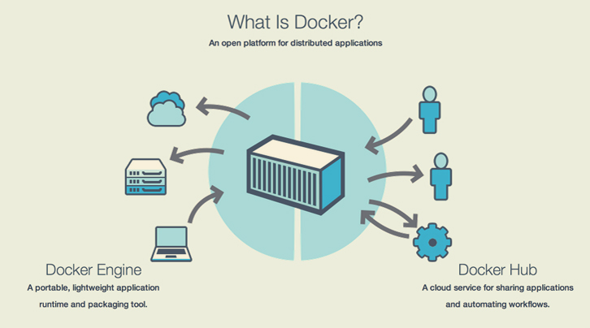
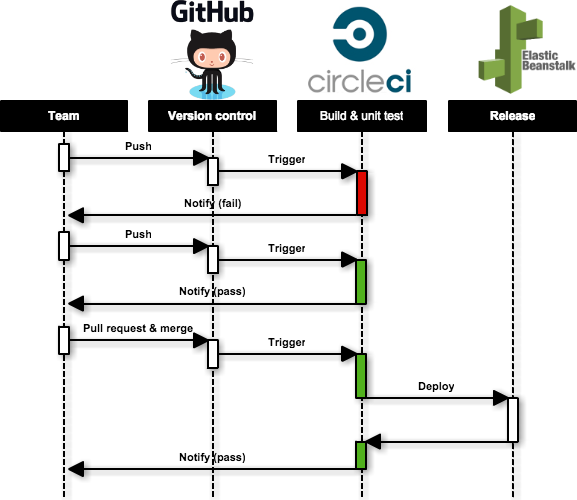

[Image source](http://alma.asiaa.sinica.edu.tw/_img/site_multimedia/2013AOS/IMG_4017.jpg)
## Weekly report 2018/06/11~2018/06/17

#### 1. micro web socket study
* [uWebSockets](https://github.com/uNetworking/uWebSockets)
* WebSocket implementation for c++, javascript(Node.js)
* 目前号称最高性能的websocket c++库
* [Comparison of WebSocket implementations](https://en.wikipedia.org/wiki/Comparison_of_WebSocket_implementations)
* [TODO][github repo of my practice:]
* possible entry in CARTA? 

#### 2. build carta viewer again on CentOS
* [CARTA viewer](https://github.com/CARTAvis/carta)
* build CASA, buildcasa.sh感覺需要整理一下
  * [Fix] typo/delete in /home/duidae/projects/CARTA/CARTAvis/carta/scripts/buildcasa.sh
    * 3 ## TODO: remove installinging
    * 77     #### install Qt 4.8.5
    * 78     # sudo yum -y install qt-devel.x86_64
    * 79     # alias qmake='qmake-qt4'
    * remove commented code
    * comment註明路徑(casa, casacore)
    * 282 cd ../../code  //路徑有問題

#### 3. computer change to MacbookPro
* ok

#### 4. study CASA
* running on Redhat 6/7 & Mac OS X
* difference between Redhat/CentOS: CentOS is a community-developed and supported alternative to RHEL(Red Hat Enterprise Linux). It is similar to Red Hat Enterprise Linux but lacks the enterprise-level support. CentOS is more or less a free replacement for RHEL with few minor configuration differences.

#### 5. install CentOS, RHEL for practice
* ok

## [TODO]Weekly report 2018/06/18~2018/06/24
1. Trace carta
2. read issues/pull requests
3. license study

## Weekly report 2018/06/04~2018/06/10

#### 0. webpage for working progress
* ok
* [webpage](https://duidae.github.io/Asiaa-work/)

#### 1. Google protocol buffers study
* smaller, faster, binary message structure like json
* protocol buffers: [https://developers.google.com/protocol-buffers/](https://developers.google.com/protocol-buffers/)
* [Overview](https://developers.google.com/protocol-buffers/docs/overview), [Tutorials](https://developers.google.com/protocol-buffers/docs/tutorials), [Github](https://github.com/google/protobuf/releases)
* .proto defines message strucuture, compiler generates corresponding .h .cc file
* github repo of my practice: [cpp only(modified makefile)](https://github.com/duidae/Asiaa-work/tree/master/protobuf-example)
* possible entry in CARTA? our protobuf message structure?
* good solution for large size json needed encryption

#### 2. qt creator installation 
* ok

#### 3. preparation for report on 7/2
* computer discuss with Mark, spec ok
* necessary materials for Vicky in advance, ok

#### 4. docker study
* docker cookbook, O'reilly

#### 5. DevOps
* really helpful article...[github, CircleCI, docker](http://blog.amowu.com/2015/04/devops-continuous-integration-delivery-docker-circleci-aws-beanstalk.html)

#### 5. how to do open source development/run open source project
* Innovation Happens Elsewhere (Version 1.0) [Nice ebook](https://www.dreamsongs.com/IHE/)

## Reference
* [ALMA](http://www.almaobservatory.org/en/home/)
* [ALMA @ Asiaa](http://alma.asiaa.sinica.edu.tw/index.php)
  * [Fix]deadlink http://almat3.asiaa.sinica.edu.tw/ganglia/
  * Interesting & beautiful, rock band?!! http://alma.asiaa.sinica.edu.tw/intro_multimedia.php
  * AcidMan: ALMA https://www.youtube.com/watch?v=ylEDfirYJaY
* [ALMA kids](http://kids.alma.cl/?lang=zh)
* [ALMA sounds(art)](http://www.almasounds.org/)
* [CASA](https://casa.nrao.edu/)
* [Code NASA](https://code.nasa.gov/)
* [Data NASA](https://data.nasa.gov/)
* markdown syntax: [mastering markdown](https://guides.github.com/features/mastering-markdown/), [chinese](https://github.com/othree/markdown-syntax-zhtw)

## C++
* lambda expression(anonymous function)
  * [https://en.wikipedia.org/wiki/Anonymous_function#C++_(since_C++11)](https://en.wikipedia.org/wiki/Anonymous_function#C++_(since_C++11))
  * [http://en.cppreference.com/w/cpp/language/lambda](http://en.cppreference.com/w/cpp/language/lambda)
  * [https://msdn.microsoft.com/zh-tw/library/dd293608.aspx](https://msdn.microsoft.com/zh-tw/library/dd293608.aspx)
  * [https://kheresy.wordpress.com/2010/05/27/c0x%EF%BC%9Alambda-expression/](https://kheresy.wordpress.com/2010/05/27/c0x%EF%BC%9Alambda-expression/)
* STL documentation:
  * [http://www.cplusplus.com/reference/stl/](http://www.cplusplus.com/reference/stl/)

## Installing CentOS, RHEL
* find usb device
  * $ lsblk
* format usb to FAT32
  * $ mkdosfs -F 32 -I /dev/sdb
* write ISO to usb
  * $ dd if=/home/testuser/Downloads/rhel-server-7.0x86_64-boot.iso of=/dev/sdb
  * $ watch -n 5 killall -USR1 dd //check dd progress
* usb不能用太爛的...雜牌的dd copy不進去/copy進去裝不起來...創見的就都ok裝的起來...what the hell??
* RHEL needs $$, ALMA Taiwan ARC uses CentOS 7.2(ALMA T1~T7)
* adsl on CentOS
  * http://blog.kevinlinul.idv.tw/?p=174
  * $ adsl-start
* change boot order https://www.cnet.com/how-to/how-to-change-the-boot-order-of-a-dual-boot-linux-pc/

## Questions
* why not open source CASA directly?
* do we use Slack?
